## Part 1

## Purpose

This exercise pack contains 10 independent use cases. Every use case has:

- exactly one entity/table;
- a logical ER diagram;
- a physical MySQL ER diagram;
- business rules and physical constraints; and
- a learner task to write SQL statement.

Use the diagrams and requirements to build each table yourself.

## General instructions

For every use case:

1. Read the scenario and business rules.
2. Study the logical ER diagram.
3. Translate the physical diagram and requirements into MySQL DDL.
4. Give every constraint a meaningful name.
5. Insert at least five valid rows.
6. Try at least one invalid row to verify each `UNIQUE`, `NOT NULL`, or `CHECK` rule.

> Physical ER diagrams show compact type names such as `VARCHAR_15` for `VARCHAR(15)` and `DECIMAL_12_2` for `DECIMAL(12,2)`. Requirements such as `AUTO_INCREMENT`, `NOT NULL`, defaults, and checks are stated below each diagram.

---

# Use Case 1: Student Academic Profile

**Suggested table name:** `students`

**Difficulty:** Beginner

## Scenario

A college needs one table containing the current academic profile of each student. Department and program information are stored as text because this exercise must not use related tables.

## Conceptual ER diagram

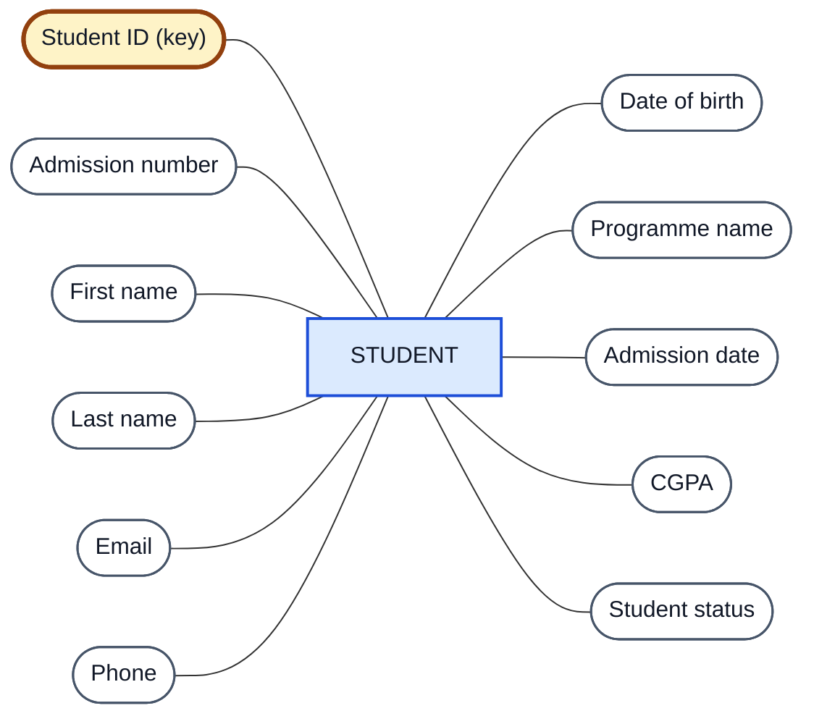
```mermaid
flowchart LR
    STUDENT_ID(["Student ID (key)"]):::key --- STUDENT["STUDENT"]:::entity
    ADMISSION(["Admission number"]):::attribute --- STUDENT
    FIRST_NAME(["First name"]):::attribute --- STUDENT
    LAST_NAME(["Last name"]):::attribute --- STUDENT
    EMAIL(["Email"]):::attribute --- STUDENT
    PHONE(["Phone"]):::attribute --- STUDENT

    STUDENT --- DOB(["Date of birth"]):::attribute
    STUDENT --- PROGRAM(["Programme name"]):::attribute
    STUDENT --- ADMISSION_DATE(["Admission date"]):::attribute
    STUDENT --- CGPA(["CGPA"]):::attribute
    STUDENT --- STATUS(["Student status"]):::attribute

    classDef entity fill:#dbeafe,stroke:#1d4ed8,stroke-width:2px,color:#111827;
    classDef attribute fill:#ffffff,stroke:#475569,stroke-width:1.5px,color:#111827;
    classDef key fill:#fef3c7,stroke:#92400e,stroke-width:3px,color:#111827;
```

**Entity:** Student  
**Key attribute:** Student ID

## Logical ER diagram

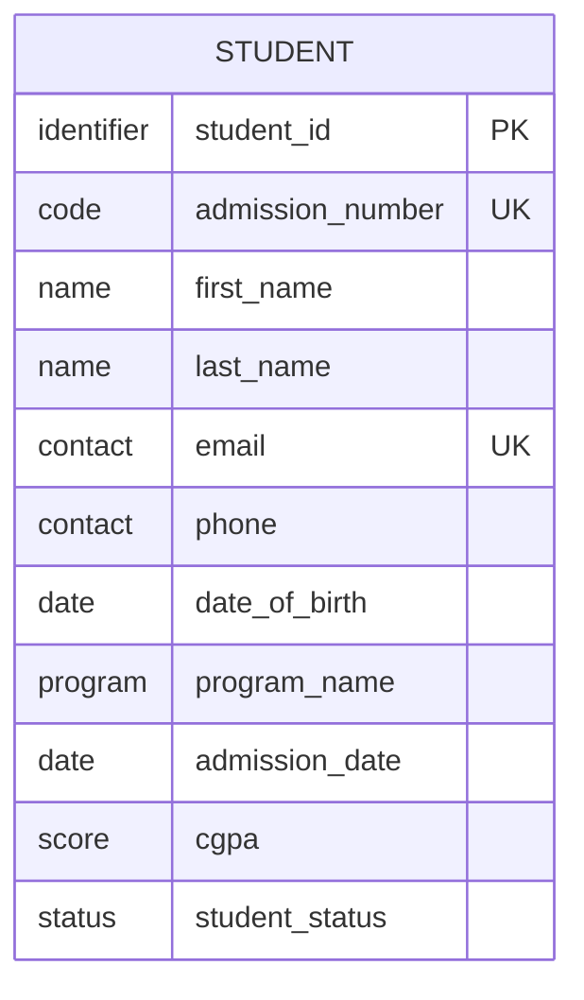
```mermaid
erDiagram
    STUDENT {
        identifier student_id PK
        code admission_number UK
        name first_name
        name last_name
        contact email UK
        contact phone
        date date_of_birth
        program program_name
        date admission_date
        score cgpa
        status student_status
    }
```

## Business rules

1. Every student has a system-generated identifier.
2. Admission number and email address must each be unique.
3. Phone number is optional.
4. CGPA must be between `0.00` and `10.00`.
5. Status must be `ACTIVE`, `GRADUATED`, `DROPPED`, or `SUSPENDED`.
6. New students are active by default.

## Physical ER diagram

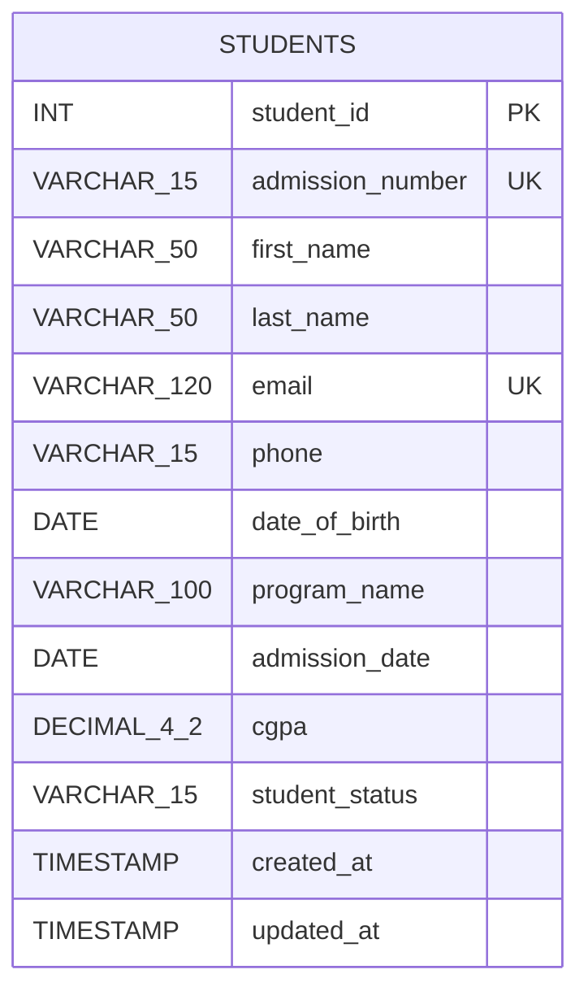
```mermaid
erDiagram
    STUDENTS {
        INT student_id PK
        VARCHAR_15 admission_number UK
        VARCHAR_50 first_name
        VARCHAR_50 last_name
        VARCHAR_120 email UK
        VARCHAR_15 phone
        DATE date_of_birth
        VARCHAR_100 program_name
        DATE admission_date
        DECIMAL_4_2 cgpa
        VARCHAR_15 student_status
        TIMESTAMP created_at
        TIMESTAMP updated_at
    }
```

## Physical requirements

- `student_id`: primary key and `AUTO_INCREMENT`.
- Required: admission number, names, email, date of birth, program, admission date, CGPA, and status.
- `phone`: nullable.
- Unique constraints: `admission_number`, `email`.
- Check: `cgpa BETWEEN 0.00 AND 10.00`.
- `student_status`: default `ACTIVE`.
- `created_at`: default current timestamp.
- `updated_at`: current timestamp on insert and automatic update.

## Your task

Write and execute the MySQL statement that creates `students` with all specified columns and constraints.

---

# Use Case 2: Product Inventory

**Suggested table name:** `products`

**Difficulty:** Beginner to intermediate

## Scenario

A small shop needs one table for its product catalogue and current stock levels. Category and brand are stored in the same table to keep the exercise relation-free.

## Conceptual ER diagram

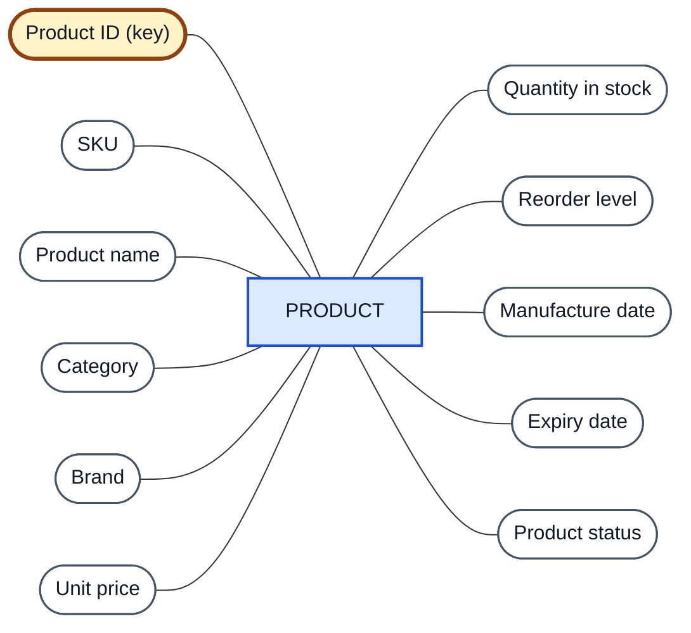
```mermaid
flowchart LR
    PRODUCT_ID(["Product ID (key)"]):::key --- PRODUCT["PRODUCT"]:::entity
    SKU(["SKU"]):::attribute --- PRODUCT
    NAME(["Product name"]):::attribute --- PRODUCT
    CATEGORY(["Category"]):::attribute --- PRODUCT
    BRAND(["Brand"]):::attribute --- PRODUCT
    PRICE(["Unit price"]):::attribute --- PRODUCT

    PRODUCT --- STOCK(["Quantity in stock"]):::attribute
    PRODUCT --- REORDER(["Reorder level"]):::attribute
    PRODUCT --- MFG_DATE(["Manufacture date"]):::attribute
    PRODUCT --- EXPIRY(["Expiry date"]):::attribute
    PRODUCT --- STATUS(["Product status"]):::attribute

    classDef entity fill:#dbeafe,stroke:#1d4ed8,stroke-width:2px,color:#111827;
    classDef attribute fill:#ffffff,stroke:#475569,stroke-width:1.5px,color:#111827;
    classDef key fill:#fef3c7,stroke:#92400e,stroke-width:3px,color:#111827;
```

**Entity:** Product  
**Key attribute:** Product ID

## Logical ER diagram

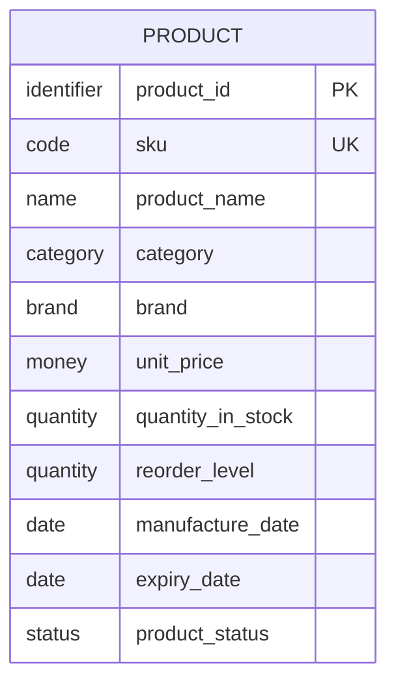
```mermaid
erDiagram
    PRODUCT {
        identifier product_id PK
        code sku UK
        name product_name
        category category
        brand brand
        money unit_price
        quantity quantity_in_stock
        quantity reorder_level
        date manufacture_date
        date expiry_date
        status product_status
    }
```

## Business rules

1. Every product has a unique SKU.
2. Product name, category, price, and stock quantity are required.
3. Brand, manufacture date, and expiry date are optional.
4. Unit price must be greater than zero.
5. Stock quantity and reorder level cannot be negative.
6. If both dates exist, expiry date cannot be earlier than manufacture date.
7. Status must be `ACTIVE`, `OUT_OF_STOCK`, or `DISCONTINUED`.

## Physical ER diagram

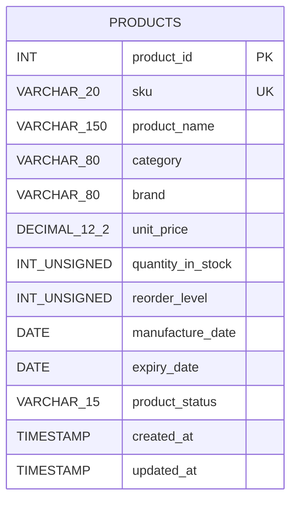
```mermaid
erDiagram
    PRODUCTS {
        INT product_id PK
        VARCHAR_20 sku UK
        VARCHAR_150 product_name
        VARCHAR_80 category
        VARCHAR_80 brand
        DECIMAL_12_2 unit_price
        INT_UNSIGNED quantity_in_stock
        INT_UNSIGNED reorder_level
        DATE manufacture_date
        DATE expiry_date
        VARCHAR_15 product_status
        TIMESTAMP created_at
        TIMESTAMP updated_at
    }
```

## Physical requirements

- `product_id`: primary key and `AUTO_INCREMENT`.
- Required: SKU, product name, category, unit price, stock quantity, reorder level, and status.
- Nullable: brand, manufacture date, expiry date.
- `sku`: unique.
- `quantity_in_stock`: default `0`.
- `reorder_level`: default `5`.
- `product_status`: default `ACTIVE`.
- Check: `unit_price > 0`.
- Check: stock quantity and reorder level are non-negative.
- Check: expiry date is null or manufacture date is null or expiry date is not before manufacture date.
- Include automatic creation and update timestamps.

## Your task

Create `products`, then test it with one normal product, one product without an expiry date, and one invalid negative-price product.

---

# Use Case 3: Customer Profile

**Suggested table name:** `customers`

**Difficulty:** Beginner to intermediate

## Scenario

A retailer needs one table for customer identity, contact information, location, customer category, and credit settings.

## Conceptual ER diagram

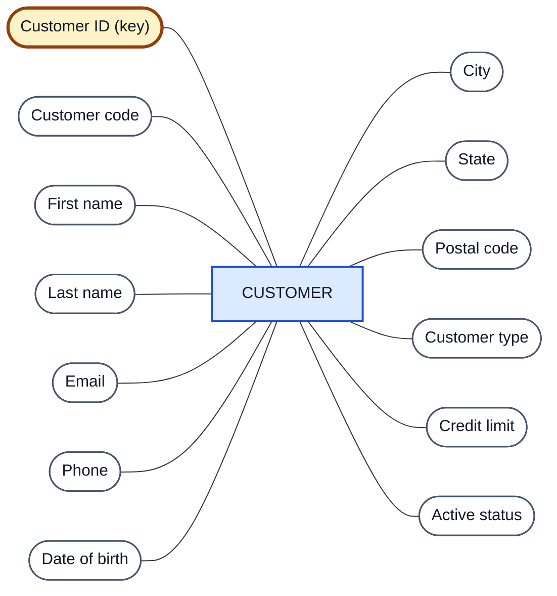
```mermaid
flowchart LR
    CUSTOMER_ID(["Customer ID (key)"]):::key --- CUSTOMER["CUSTOMER"]:::entity
    CODE(["Customer code"]):::attribute --- CUSTOMER
    FIRST_NAME(["First name"]):::attribute --- CUSTOMER
    LAST_NAME(["Last name"]):::attribute --- CUSTOMER
    EMAIL(["Email"]):::attribute --- CUSTOMER
    PHONE(["Phone"]):::attribute --- CUSTOMER
    DOB(["Date of birth"]):::attribute --- CUSTOMER

    CUSTOMER --- CITY(["City"]):::attribute
    CUSTOMER --- STATE(["State"]):::attribute
    CUSTOMER --- POSTAL(["Postal code"]):::attribute
    CUSTOMER --- TYPE(["Customer type"]):::attribute
    CUSTOMER --- CREDIT(["Credit limit"]):::attribute
    CUSTOMER --- ACTIVE(["Active status"]):::attribute

    classDef entity fill:#dbeafe,stroke:#1d4ed8,stroke-width:2px,color:#111827;
    classDef attribute fill:#ffffff,stroke:#475569,stroke-width:1.5px,color:#111827;
    classDef key fill:#fef3c7,stroke:#92400e,stroke-width:3px,color:#111827;
```

**Entity:** Customer  
**Key attribute:** Customer ID

## Logical ER diagram

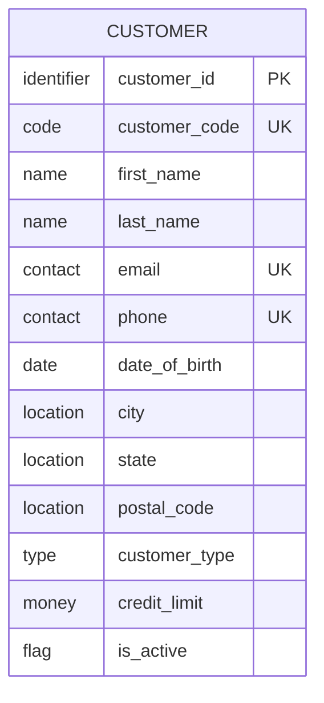
```mermaid
erDiagram
    CUSTOMER {
        identifier customer_id PK
        code customer_code UK
        name first_name
        name last_name
        contact email UK
        contact phone UK
        date date_of_birth
        location city
        location state
        location postal_code
        type customer_type
        money credit_limit
        flag is_active
    }
```

## Business rules

1. Customer code and email must be unique.
2. A phone number is optional, but any stored phone number must be unique.
3. Date of birth is optional.
4. Customer type must be `REGULAR`, `PREMIUM`, or `CORPORATE`.
5. Credit limit cannot be negative.
6. New customers are active and regular by default.

## Physical ER diagram

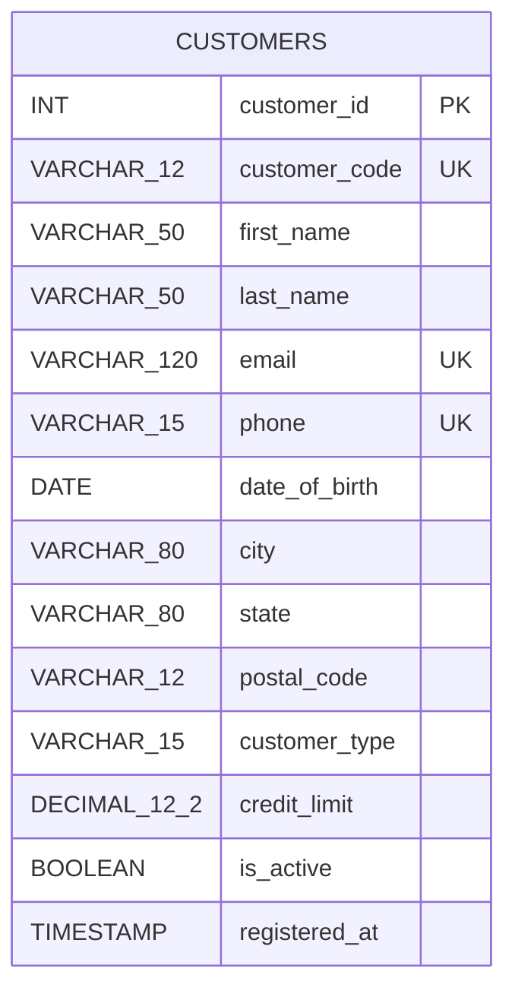
```mermaid
erDiagram
    CUSTOMERS {
        INT customer_id PK
        VARCHAR_12 customer_code UK
        VARCHAR_50 first_name
        VARCHAR_50 last_name
        VARCHAR_120 email UK
        VARCHAR_15 phone UK
        DATE date_of_birth
        VARCHAR_80 city
        VARCHAR_80 state
        VARCHAR_12 postal_code
        VARCHAR_15 customer_type
        DECIMAL_12_2 credit_limit
        BOOLEAN is_active
        TIMESTAMP registered_at
    }
```

## Physical requirements

- `customer_id`: primary key and `AUTO_INCREMENT`.
- Required: customer code, names, email, city, state, postal code, customer type, credit limit, and active flag.
- Nullable: phone, date of birth.
- Unique constraints: customer code, email, phone.
- `customer_type`: default `REGULAR`.
- `credit_limit`: default `0.00` and must be non-negative.
- `is_active`: default `TRUE`.
- `registered_at`: default current timestamp.

## Your task

Create `customers`. Verify that MySQL accepts multiple `NULL` phone values but rejects a repeated non-null phone number.

---

# Use Case 4: Book Catalogue

**Suggested table name:** `books`

**Difficulty:** Intermediate

## Scenario

A bookstore needs a single table describing each book and its available quantity. Author, genre, and publisher remain text attributes for this exercise.

## Conceptual ER diagram

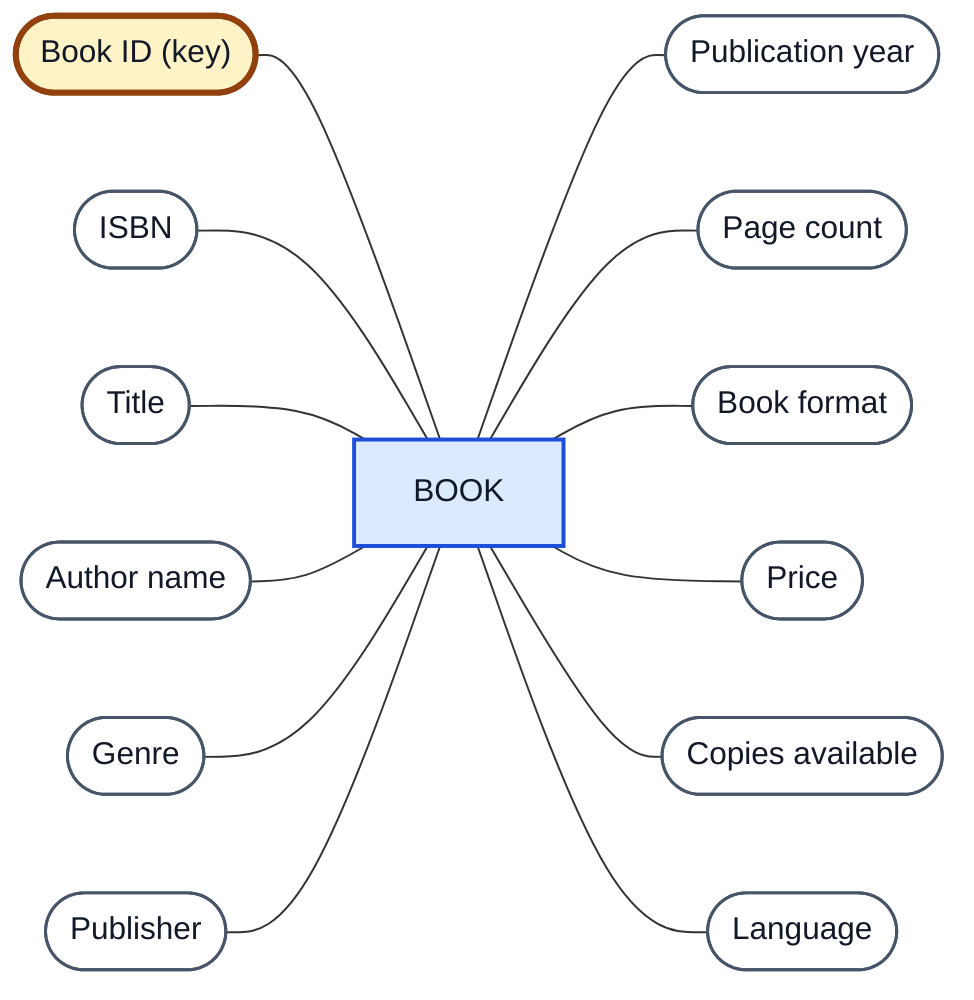
```mermaid
flowchart LR
    BOOK_ID(["Book ID (key)"]):::key --- BOOK["BOOK"]:::entity
    ISBN(["ISBN"]):::attribute --- BOOK
    TITLE(["Title"]):::attribute --- BOOK
    AUTHOR(["Author name"]):::attribute --- BOOK
    GENRE(["Genre"]):::attribute --- BOOK
    PUBLISHER(["Publisher"]):::attribute --- BOOK

    BOOK --- PUB_YEAR(["Publication year"]):::attribute
    BOOK --- PAGES(["Page count"]):::attribute
    BOOK --- FORMAT(["Book format"]):::attribute
    BOOK --- PRICE(["Price"]):::attribute
    BOOK --- COPIES(["Copies available"]):::attribute
    BOOK --- LANGUAGE(["Language"]):::attribute

    classDef entity fill:#dbeafe,stroke:#1d4ed8,stroke-width:2px,color:#111827;
    classDef attribute fill:#ffffff,stroke:#475569,stroke-width:1.5px,color:#111827;
    classDef key fill:#fef3c7,stroke:#92400e,stroke-width:3px,color:#111827;
```

**Entity:** Book  
**Key attribute:** Book ID

## Logical ER diagram

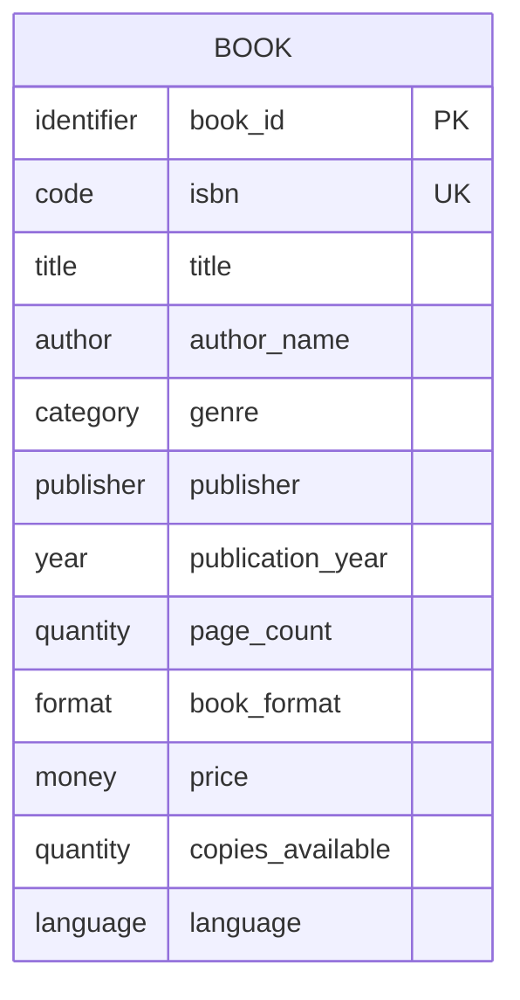
```mermaid
erDiagram
    BOOK {
        identifier book_id PK
        code isbn UK
        title title
        author author_name
        category genre
        publisher publisher
        year publication_year
        quantity page_count
        format book_format
        money price
        quantity copies_available
        language language
    }
```

## Business rules

1. ISBN uniquely identifies a book edition.
2. Title, author, genre, year, page count, format, price, available copies, and language are required.
3. Publisher is optional.
4. Publication year must be between `1000` and `2100`.
5. Page count must be greater than zero.
6. Price and available copies cannot be negative.
7. Format must be `HARDCOVER`, `PAPERBACK`, or `EBOOK`.

## Physical ER diagram

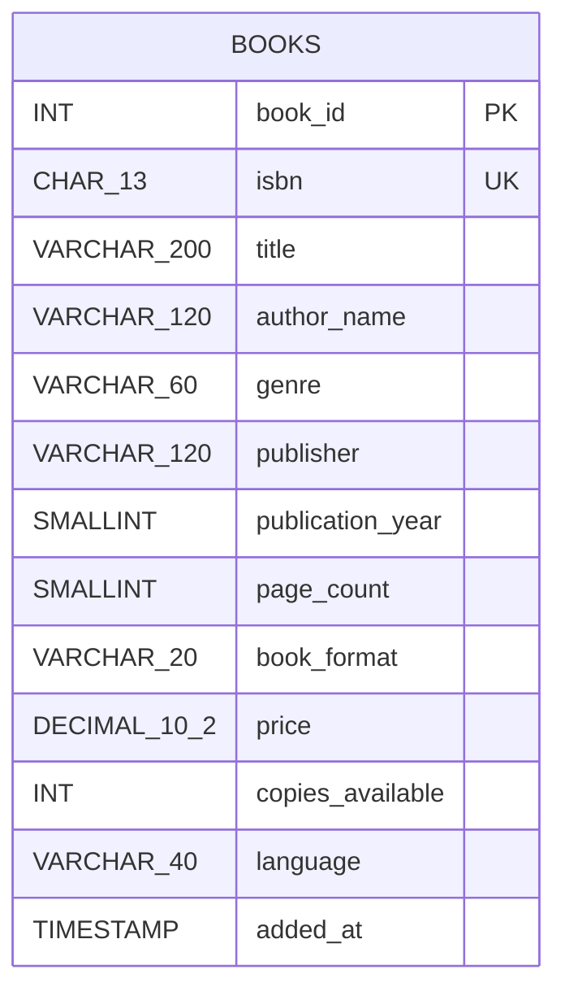
```mermaid
erDiagram
    BOOKS {
        INT book_id PK
        CHAR_13 isbn UK
        VARCHAR_200 title
        VARCHAR_120 author_name
        VARCHAR_60 genre
        VARCHAR_120 publisher
        SMALLINT publication_year
        SMALLINT page_count
        VARCHAR_20 book_format
        DECIMAL_10_2 price
        INT copies_available
        VARCHAR_40 language
        TIMESTAMP added_at
    }
```

## Physical requirements

- `book_id`: primary key and `AUTO_INCREMENT`.
- `isbn`: exactly 13 characters and unique.
- `publisher`: nullable; all other catalogue attributes are required.
- Check: publication year between `1000` and `2100`.
- Check: page count greater than `0`.
- Check: price and copies available are non-negative.
- `language`: default `English`.
- `added_at`: default current timestamp.

## Your task

Create `books` and test the year, page-count, ISBN, and format constraints with both valid and invalid inserts.

---

# Use Case 5: Patient Registration

**Suggested table name:** `patients`

**Difficulty:** Intermediate

## Scenario

A small clinic needs a one-table patient-registration exercise. It stores identity, contact information, emergency contact information, and a short allergy note. Use fictional data only.

## Conceptual ER diagram

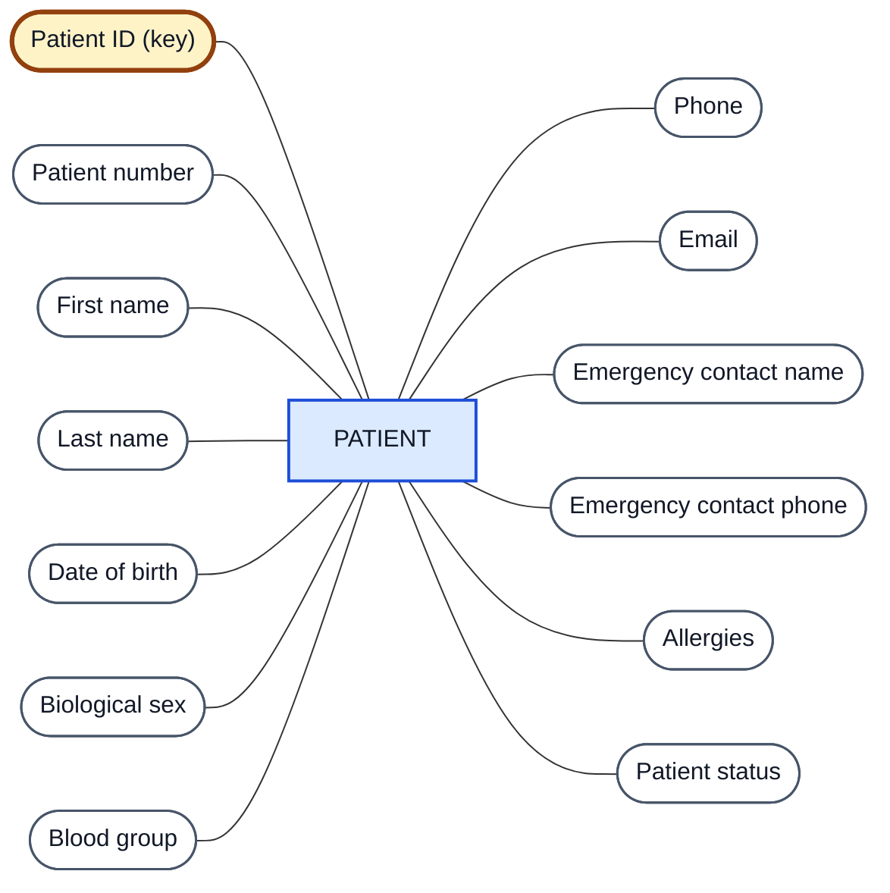
```mermaid
flowchart LR
    PATIENT_ID(["Patient ID (key)"]):::key --- PATIENT["PATIENT"]:::entity
    NUMBER(["Patient number"]):::attribute --- PATIENT
    FIRST_NAME(["First name"]):::attribute --- PATIENT
    LAST_NAME(["Last name"]):::attribute --- PATIENT
    DOB(["Date of birth"]):::attribute --- PATIENT
    SEX(["Biological sex"]):::attribute --- PATIENT
    BLOOD(["Blood group"]):::attribute --- PATIENT

    PATIENT --- PHONE(["Phone"]):::attribute
    PATIENT --- EMAIL(["Email"]):::attribute
    PATIENT --- EMERGENCY_NAME(["Emergency contact name"]):::attribute
    PATIENT --- EMERGENCY_PHONE(["Emergency contact phone"]):::attribute
    PATIENT --- ALLERGIES(["Allergies"]):::attribute
    PATIENT --- STATUS(["Patient status"]):::attribute

    classDef entity fill:#dbeafe,stroke:#1d4ed8,stroke-width:2px,color:#111827;
    classDef attribute fill:#ffffff,stroke:#475569,stroke-width:1.5px,color:#111827;
    classDef key fill:#fef3c7,stroke:#92400e,stroke-width:3px,color:#111827;
```

**Entity:** Patient  
**Key attribute:** Patient ID

## Logical ER diagram

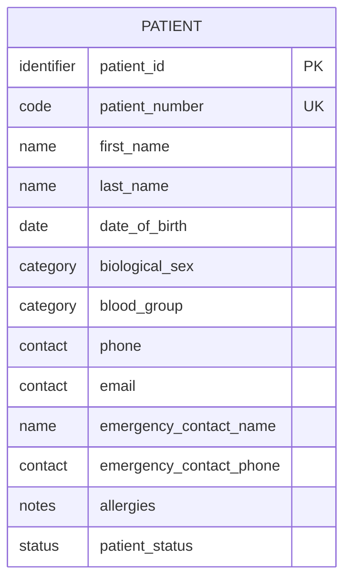
```mermaid
erDiagram
    PATIENT {
        identifier patient_id PK
        code patient_number UK
        name first_name
        name last_name
        date date_of_birth
        category biological_sex
        category blood_group
        contact phone
        contact email
        name emergency_contact_name
        contact emergency_contact_phone
        notes allergies
        status patient_status
    }
```

## Business rules

1. Patient number is unique.
2. Names, date of birth, phone, biological sex, emergency contact, and status are required.
3. Email, blood group, and allergy notes are optional.
4. Biological sex must be `FEMALE`, `MALE`, `INTERSEX`, or `NOT_DISCLOSED`.
5. Blood group, when present, must be one of the eight standard ABO/Rh groups.
6. Patient status must be `ACTIVE`, `INACTIVE`, or `DECEASED`.

## Physical ER diagram

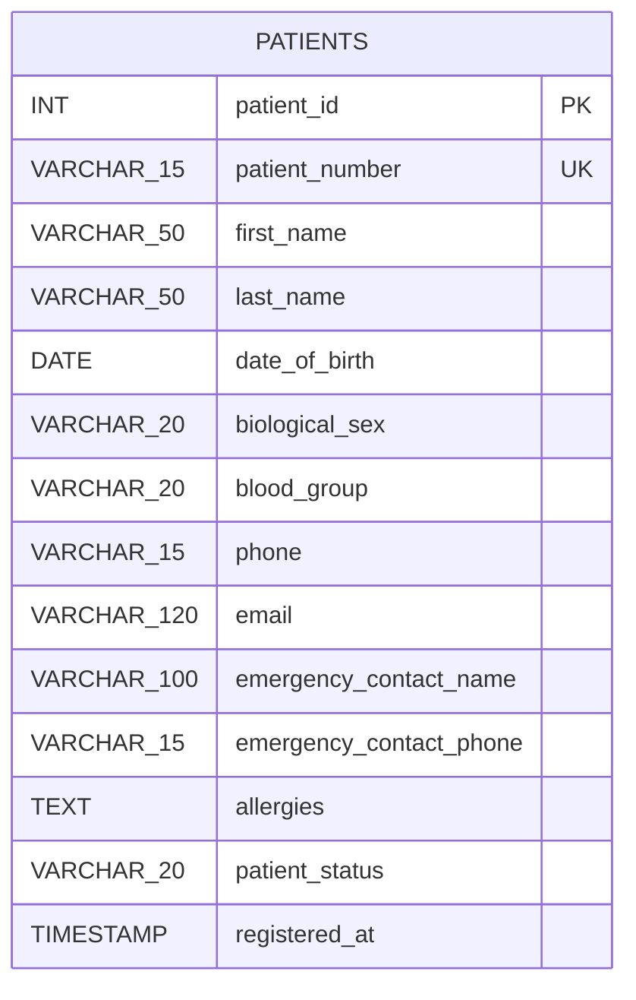
```mermaid
erDiagram
    PATIENTS {
        INT patient_id PK
        VARCHAR_15 patient_number UK
        VARCHAR_50 first_name
        VARCHAR_50 last_name
        DATE date_of_birth
        VARCHAR_20 biological_sex
        VARCHAR_20 blood_group
        VARCHAR_15 phone
        VARCHAR_120 email
        VARCHAR_100 emergency_contact_name
        VARCHAR_15 emergency_contact_phone
        TEXT allergies
        VARCHAR_20 patient_status
        TIMESTAMP registered_at
    }
```

## Physical requirements

- `patient_id`: primary key and `AUTO_INCREMENT`.
- `patient_number`: unique.
- Nullable: email, blood group, allergies.
- Blood-group values: `A+`, `A-`, `B+`, `B-`, `AB+`, `AB-`, `O+`, `O-`.
- `patient_status`: default `ACTIVE`.
- `registered_at`: default current timestamp.
- Do not use real patient information while testing.

## Your task

Create `patients`, including both `ENUM` definitions, and verify that an unsupported blood-group value is rejected.

---

# Use Case 6: Bank Account Summary

**Suggested table name:** `bank_accounts`

**Difficulty:** Intermediate

## Scenario

A training application needs a simplified, denormalised account table. It is for SQL practice only and must not be used as a real banking design.

## Conceptual ER diagram

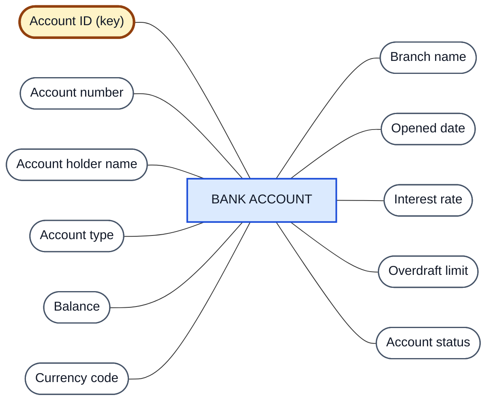
```mermaid
flowchart LR
    ACCOUNT_ID(["Account ID (key)"]):::key --- ACCOUNT["BANK ACCOUNT"]:::entity
    NUMBER(["Account number"]):::attribute --- ACCOUNT
    HOLDER(["Account holder name"]):::attribute --- ACCOUNT
    TYPE(["Account type"]):::attribute --- ACCOUNT
    BALANCE(["Balance"]):::attribute --- ACCOUNT
    CURRENCY(["Currency code"]):::attribute --- ACCOUNT

    ACCOUNT --- BRANCH(["Branch name"]):::attribute
    ACCOUNT --- OPENED(["Opened date"]):::attribute
    ACCOUNT --- INTEREST(["Interest rate"]):::attribute
    ACCOUNT --- OVERDRAFT(["Overdraft limit"]):::attribute
    ACCOUNT --- STATUS(["Account status"]):::attribute

    classDef entity fill:#dbeafe,stroke:#1d4ed8,stroke-width:2px,color:#111827;
    classDef attribute fill:#ffffff,stroke:#475569,stroke-width:1.5px,color:#111827;
    classDef key fill:#fef3c7,stroke:#92400e,stroke-width:3px,color:#111827;
```

**Entity:** Bank Account  
**Key attribute:** Account ID

## Logical ER diagram

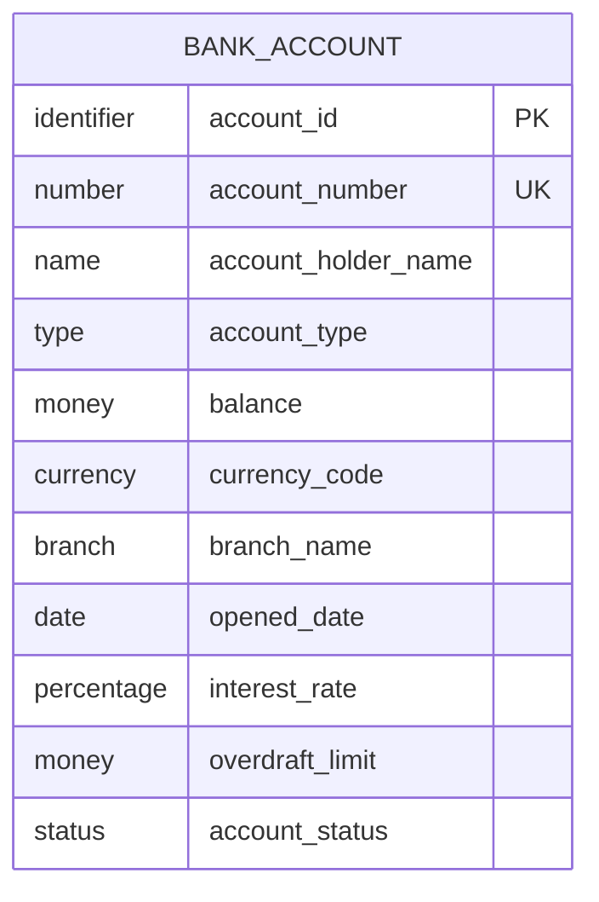
```mermaid
erDiagram
    BANK_ACCOUNT {
        identifier account_id PK
        number account_number UK
        name account_holder_name
        type account_type
        money balance
        currency currency_code
        branch branch_name
        date opened_date
        percentage interest_rate
        money overdraft_limit
        status account_status
    }
```

## Business rules

1. Account number is unique.
2. Account holder, account type, balance, currency, branch, opened date, and status are required.
3. Account type must be `SAVINGS`, `CURRENT`, or `FIXED_DEPOSIT`.
4. Balance and overdraft limit cannot be negative in this simplified model.
5. Interest rate must be between `0.00` and `100.00`.
6. Currency is a three-letter ISO-style code and defaults to `INR`.
7. Status must be `ACTIVE`, `FROZEN`, `DORMANT`, or `CLOSED`.

## Physical ER diagram

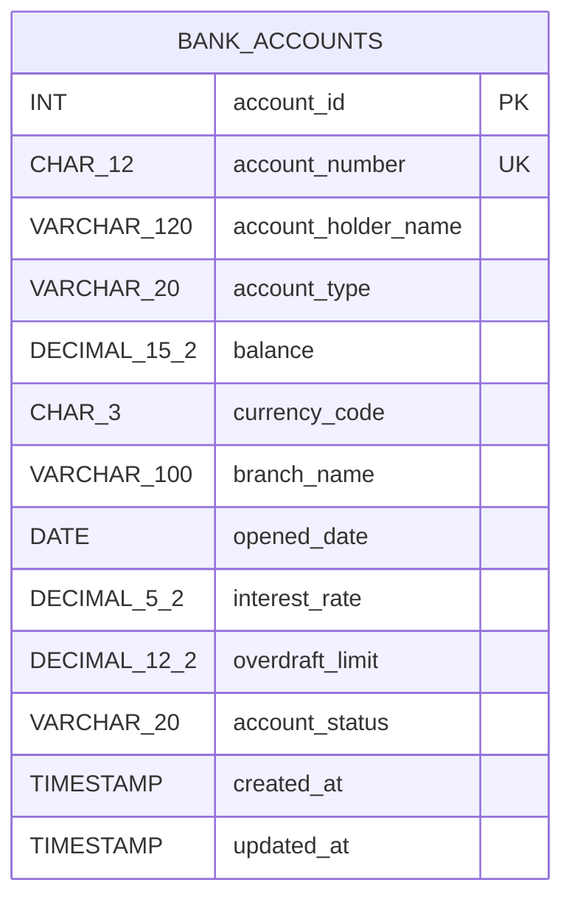
```mermaid
erDiagram
    BANK_ACCOUNTS {
        INT account_id PK
        CHAR_12 account_number UK
        VARCHAR_120 account_holder_name
        VARCHAR_20 account_type
        DECIMAL_15_2 balance
        CHAR_3 currency_code
        VARCHAR_100 branch_name
        DATE opened_date
        DECIMAL_5_2 interest_rate
        DECIMAL_12_2 overdraft_limit
        VARCHAR_20 account_status
        TIMESTAMP created_at
        TIMESTAMP updated_at
    }
```

## Physical requirements

- `account_id`: primary key and `AUTO_INCREMENT`.
- `account_number`: exactly 12 characters and unique.
- `balance`, `interest_rate`, and `overdraft_limit`: required with default `0.00` where appropriate.
- Checks: non-negative balance and overdraft; interest rate from `0.00` through `100.00`.
- `currency_code`: default `INR`.
- `account_status`: default `ACTIVE`.
- Include automatic creation and update timestamps.

## Your task

Create `bank_accounts`. Insert examples for all three account types and test the numeric checks.

---

# Use Case 7: Vehicle Registry

**Suggested table name:** `vehicles`

**Difficulty:** Intermediate

## Scenario

A parking and vehicle-tracking application needs one row for each registered vehicle. Owner data is intentionally stored as text so there is no relationship to another table.

## Conceptual ER diagram

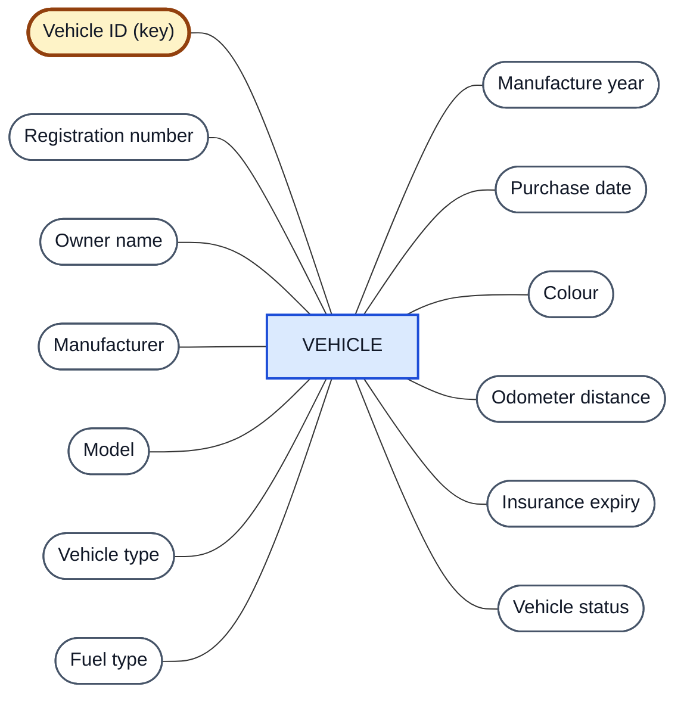
```mermaid
flowchart LR
    VEHICLE_ID(["Vehicle ID (key)"]):::key --- VEHICLE["VEHICLE"]:::entity
    REGISTRATION(["Registration number"]):::attribute --- VEHICLE
    OWNER(["Owner name"]):::attribute --- VEHICLE
    MAKER(["Manufacturer"]):::attribute --- VEHICLE
    MODEL(["Model"]):::attribute --- VEHICLE
    TYPE(["Vehicle type"]):::attribute --- VEHICLE
    FUEL(["Fuel type"]):::attribute --- VEHICLE

    VEHICLE --- YEAR(["Manufacture year"]):::attribute
    VEHICLE --- PURCHASE(["Purchase date"]):::attribute
    VEHICLE --- COLOR(["Colour"]):::attribute
    VEHICLE --- ODOMETER(["Odometer distance"]):::attribute
    VEHICLE --- INSURANCE(["Insurance expiry"]):::attribute
    VEHICLE --- STATUS(["Vehicle status"]):::attribute

    classDef entity fill:#dbeafe,stroke:#1d4ed8,stroke-width:2px,color:#111827;
    classDef attribute fill:#ffffff,stroke:#475569,stroke-width:1.5px,color:#111827;
    classDef key fill:#fef3c7,stroke:#92400e,stroke-width:3px,color:#111827;
```

**Entity:** Vehicle  
**Key attribute:** Vehicle ID

## Logical ER diagram

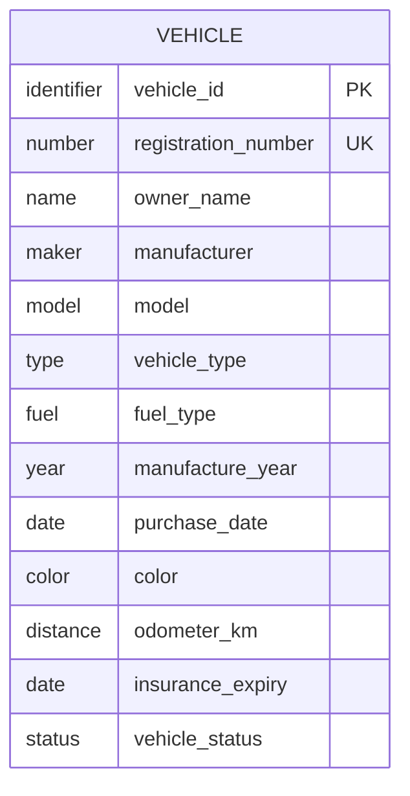
```mermaid
erDiagram
    VEHICLE {
        identifier vehicle_id PK
        number registration_number UK
        name owner_name
        maker manufacturer
        model model
        type vehicle_type
        fuel fuel_type
        year manufacture_year
        date purchase_date
        color color
        distance odometer_km
        date insurance_expiry
        status vehicle_status
    }
```

## Business rules

1. Registration number is unique.
2. Owner, manufacturer, model, vehicle type, fuel type, manufacture year, colour, odometer, and status are required.
3. Purchase date and insurance expiry are optional.
4. Vehicle type must be `CAR`, `MOTORCYCLE`, `TRUCK`, `VAN`, or `BUS`.
5. Fuel type must be `PETROL`, `DIESEL`, `ELECTRIC`, `HYBRID`, or `CNG`.
6. Odometer distance cannot be negative.
7. Status must be `ACTIVE`, `IN_SERVICE`, `SOLD`, or `SCRAPPED`.

## Physical ER diagram

```mermaid
erDiagram
    VEHICLES {
        INT vehicle_id PK
        VARCHAR_20 registration_number UK
        VARCHAR_120 owner_name
        VARCHAR_80 manufacturer
        VARCHAR_80 model
        VARCHAR_20 vehicle_type
        VARCHAR_20 fuel_type
        YEAR manufacture_year
        DATE purchase_date
        VARCHAR_40 color
        INT odometer_km
        DATE insurance_expiry
        VARCHAR_20 vehicle_status
        TIMESTAMP created_at
    }
```

## Physical requirements

- `vehicle_id`: primary key and `AUTO_INCREMENT`.
- `registration_number`: unique.
- Nullable: purchase date and insurance expiry.
- `odometer_km`: default `0` and non-negative.
- `vehicle_status`: default `ACTIVE`.
- `created_at`: default current timestamp.
- Use the exact enumerated values from the business rules.

## Your task

Create `vehicles` and test all vehicle and fuel types. Also test a row without purchase and insurance dates.

---

# Use Case 8: Hotel Room Inventory

**Suggested table name:** `hotel_rooms`

**Difficulty:** Intermediate

## Scenario

A hotel needs one table describing each room, its capacity, nightly rate, amenities, and current availability.

## Conceptual ER diagram

```mermaid
flowchart LR
    ROOM_ID(["Room ID (key)"]):::key --- ROOM["HOTEL ROOM"]:::entity
    NUMBER(["Room number"]):::attribute --- ROOM
    TYPE(["Room type"]):::attribute --- ROOM
    FLOOR(["Floor number"]):::attribute --- ROOM
    BEDS(["Bed count"]):::attribute --- ROOM
    OCCUPANCY(["Maximum occupancy"]):::attribute --- ROOM

    ROOM --- PRICE(["Price per night"]):::attribute
    ROOM --- AVAILABILITY(["Availability status"]):::attribute
    ROOM --- AC(["Air conditioning"]):::attribute
    ROOM --- SMOKING(["Smoking allowed"]):::attribute
    ROOM --- NOTES(["Notes"]):::attribute

    classDef entity fill:#dbeafe,stroke:#1d4ed8,stroke-width:2px,color:#111827;
    classDef attribute fill:#ffffff,stroke:#475569,stroke-width:1.5px,color:#111827;
    classDef key fill:#fef3c7,stroke:#92400e,stroke-width:3px,color:#111827;
```

**Entity:** Hotel Room  
**Key attribute:** Room ID

## Logical ER diagram

```mermaid
erDiagram
    HOTEL_ROOM {
        identifier room_id PK
        number room_number UK
        type room_type
        number floor_number
        quantity bed_count
        quantity max_occupancy
        money price_per_night
        status availability_status
        flag has_air_conditioning
        flag smoking_allowed
        notes notes
    }
```

## Business rules

1. Room number is unique.
2. Room type must be `SINGLE`, `DOUBLE`, `DELUXE`, or `SUITE`.
3. Bed count and maximum occupancy must each be at least one.
4. Nightly price must be greater than zero.
5. Availability must be `AVAILABLE`, `RESERVED`, `OCCUPIED`, or `MAINTENANCE`.
6. Air conditioning defaults to available, and smoking defaults to not allowed.
7. Notes are optional.

## Physical ER diagram

```mermaid
erDiagram
    HOTEL_ROOMS {
        INT room_id PK
        VARCHAR_10 room_number UK
        VARCHAR_20 room_type
        SMALLINT floor_number
        TINYINT bed_count
        TINYINT max_occupancy
        DECIMAL_10_2 price_per_night
        VARCHAR_20 availability_status
        BOOLEAN has_air_conditioning
        BOOLEAN smoking_allowed
        VARCHAR_255 notes
        TIMESTAMP created_at
        TIMESTAMP updated_at
    }
```

## Physical requirements

- `room_id`: primary key and `AUTO_INCREMENT`.
- `room_number`: unique.
- Required: every column except notes.
- Checks: bed count and maximum occupancy at least `1`; nightly price greater than `0`.
- `availability_status`: default `AVAILABLE`.
- `has_air_conditioning`: default `TRUE`.
- `smoking_allowed`: default `FALSE`.
- Include automatic creation and update timestamps.

## Your task

Create `hotel_rooms`. Insert examples for all four room types and verify that zero occupancy and zero price are rejected.

---

# Use Case 9: Movie Catalogue

**Suggested table name:** `movies`

**Difficulty:** Intermediate

## Scenario

A streaming catalogue needs a single table containing descriptive and release information for each movie. Directors and genres remain text values.

## Conceptual ER diagram

```mermaid
flowchart LR
    MOVIE_ID(["Movie ID (key)"]):::key --- MOVIE["MOVIE"]:::entity
    CODE(["Movie code"]):::attribute --- MOVIE
    TITLE(["Title"]):::attribute --- MOVIE
    GENRE(["Genre"]):::attribute --- MOVIE
    LANGUAGE(["Original language"]):::attribute --- MOVIE
    RELEASE(["Release date"]):::attribute --- MOVIE

    MOVIE --- DURATION(["Duration in minutes"]):::attribute
    MOVIE --- DIRECTOR(["Director name"]):::attribute
    MOVIE --- CERTIFICATE(["Age certificate"]):::attribute
    MOVIE --- RATING(["Audience rating"]):::attribute
    MOVIE --- BUDGET(["Production budget"]):::attribute
    MOVIE --- STATUS(["Catalogue status"]):::attribute

    classDef entity fill:#dbeafe,stroke:#1d4ed8,stroke-width:2px,color:#111827;
    classDef attribute fill:#ffffff,stroke:#475569,stroke-width:1.5px,color:#111827;
    classDef key fill:#fef3c7,stroke:#92400e,stroke-width:3px,color:#111827;
```

**Entity:** Movie  
**Key attribute:** Movie ID

## Logical ER diagram

```mermaid
erDiagram
    MOVIE {
        identifier movie_id PK
        code movie_code UK
        title title
        category genre
        language original_language
        date release_date
        duration duration_minutes
        name director_name
        certificate age_certificate
        rating audience_rating
        money production_budget
        status catalog_status
    }
```

## Business rules

1. Movie code is unique.
2. Title, genre, language, duration, director, certificate, and catalogue status are required.
3. Release date, rating, and production budget may be unknown for an upcoming movie.
4. Duration must be greater than zero.
5. Audience rating, when present, must be between `0.0` and `10.0`.
6. Production budget cannot be negative.
7. Certificate must be `ALL_AGES`, `PARENTAL_GUIDANCE`, `ADULT`, or `UNRATED`.
8. Catalogue status must be `UPCOMING`, `RELEASED`, or `ARCHIVED`.

## Physical ER diagram

```mermaid
erDiagram
    MOVIES {
        INT movie_id PK
        VARCHAR_12 movie_code UK
        VARCHAR_200 title
        VARCHAR_60 genre
        VARCHAR_40 original_language
        DATE release_date
        SMALLINT duration_minutes
        VARCHAR_120 director_name
        VARCHAR_20 age_certificate
        DECIMAL_3_1 audience_rating
        DECIMAL_15_2 production_budget
        VARCHAR_20 catalog_status
        TIMESTAMP created_at
        TIMESTAMP updated_at
    }
```

## Physical requirements

- `movie_id`: primary key and `AUTO_INCREMENT`.
- `movie_code`: unique.
- Nullable: release date, audience rating, production budget.
- Check: duration greater than `0`.
- Check: rating is null or between `0.0` and `10.0`.
- Check: budget is null or non-negative.
- `age_certificate`: default `UNRATED`.
- `catalog_status`: default `UPCOMING`.
- Include automatic creation and update timestamps.

## Your task

Create `movies`, then test an upcoming movie with unknown release information and a released movie with a valid rating.

---

# Use Case 10: Customer Support Ticket

**Suggested table name:** `support_tickets`

**Difficulty:** Intermediate to advanced

## Scenario

A small support desk needs one table for customer requests, assignment, priority, progress, and resolution time. Requester and assigned-agent details are text attributes to avoid relations.

## Conceptual ER diagram

```mermaid
flowchart LR
    TICKET_ID(["Ticket ID (key)"]):::key --- TICKET["SUPPORT TICKET"]:::entity
    NUMBER(["Ticket number"]):::attribute --- TICKET
    REQUESTER(["Requester name"]):::attribute --- TICKET
    EMAIL(["Requester email"]):::attribute --- TICKET
    SUBJECT(["Subject"]):::attribute --- TICKET
    DESCRIPTION(["Description"]):::attribute --- TICKET
    CATEGORY(["Category"]):::attribute --- TICKET

    TICKET --- PRIORITY(["Priority"]):::attribute
    TICKET --- STATUS(["Ticket status"]):::attribute
    TICKET --- AGENT(["Assigned agent"]):::attribute
    TICKET --- CREATED(["Created time"]):::attribute
    TICKET --- RESOLVED(["Resolved time"]):::attribute
    TICKET --- UPDATED(["Last updated time"]):::attribute

    classDef entity fill:#dbeafe,stroke:#1d4ed8,stroke-width:2px,color:#111827;
    classDef attribute fill:#ffffff,stroke:#475569,stroke-width:1.5px,color:#111827;
    classDef key fill:#fef3c7,stroke:#92400e,stroke-width:3px,color:#111827;
```

**Entity:** Support Ticket  
**Key attribute:** Ticket ID

## Logical ER diagram

```mermaid
erDiagram
    SUPPORT_TICKET {
        identifier ticket_id PK
        code ticket_number UK
        name requester_name
        contact requester_email
        title subject
        description description
        category category
        priority priority
        status ticket_status
        name assigned_agent
        datetime created_at
        datetime resolved_at
        datetime last_updated_at
    }
```

## Business rules

1. Ticket number is unique.
2. Requester name, requester email, subject, description, category, priority, and status are required.
3. Assigned agent and resolution time are initially optional.
4. Category must be `BILLING`, `TECHNICAL`, `ACCOUNT`, or `GENERAL`.
5. Priority must be `LOW`, `MEDIUM`, `HIGH`, or `CRITICAL`.
6. Status must be `OPEN`, `IN_PROGRESS`, `RESOLVED`, or `CLOSED`.
7. Resolution time cannot be earlier than creation time.
8. New tickets start with medium priority and open status.

## Physical ER diagram

```mermaid
erDiagram
    SUPPORT_TICKETS {
        INT ticket_id PK
        VARCHAR_20 ticket_number UK
        VARCHAR_120 requester_name
        VARCHAR_120 requester_email
        VARCHAR_200 subject
        TEXT description
        VARCHAR_20 category
        VARCHAR_20 priority
        VARCHAR_20 ticket_status
        VARCHAR_120 assigned_agent
        TIMESTAMP created_at
        TIMESTAMP resolved_at
        TIMESTAMP last_updated_at
    }
```

## Physical requirements

- `ticket_id`: primary key and `AUTO_INCREMENT`.
- `ticket_number`: unique.
- Nullable: assigned agent and resolved timestamp.
- `priority`: default `MEDIUM`.
- `ticket_status`: default `OPEN`.
- `created_at`: default current timestamp.
- `last_updated_at`: current timestamp on insert and automatic update.
- Check: resolved timestamp is null or not earlier than created timestamp.

## Your task

Create `support_tickets`. Test default priority/status, a null resolution time, and an invalid resolution time earlier than creation.

---

# Submission Checklist

For each of the 10 tables, confirm the following before considering the exercise complete:

- The table contains only the attributes shown for that use case.
- No foreign keys or relationships were added.
- The primary key uses the specified integer type and auto-increment behaviour.
- Every required column is `NOT NULL`.
- Every optional column accepts `NULL`.
- All unique constraints are present.
- All defaults are correct.
- All numeric and date checks are present.
- Timestamp behaviour matches the requirements.
- At least five valid rows were inserted.
- Invalid inserts were attempted to confirm constraint enforcement.

## Suggested completion order

1. `students`
2. `products`
3. `customers`
4. `books`
5. `patients`
6. `bank_accounts`
7. `vehicles`
8. `hotel_rooms`
9. `movies`
10. `support_tickets`

<!-- Mermaid rendering support for GitHub Pages/Jekyll. -->

